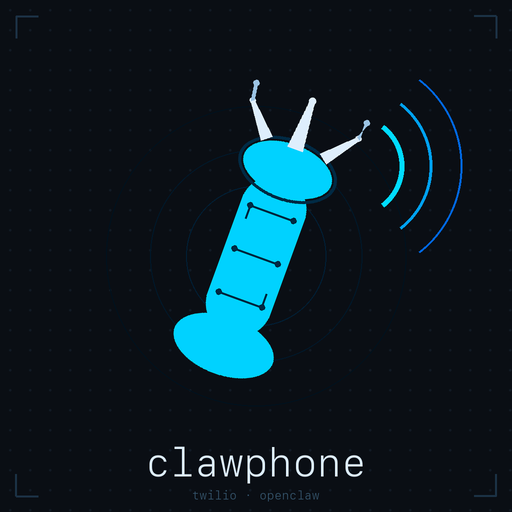

# clawphone

<p align="center">
  
</p>

[](https://github.com/ranacseruet/clawphone/actions/workflows/ci.yml)
[](https://www.npmjs.com/package/@ranacseruet/clawphone)
[](LICENSE)
[](package.json)

A Node.js HTTP gateway that bridges Twilio voice calls and SMS to the **OpenClaw** agent. No framework — raw `node:http`, ES Modules only.

Runs as a **standalone server** (Node / PM2) or as an **[OpenClaw plugin](docs/plugin-install.md)**.

## Why clawphone?

OpenClaw ships an official `@openclaw/voice-call` plugin, but it is built on a fundamentally different architecture — and has different operational requirements. clawphone is designed to be the **lightest possible path** from a Twilio phone number to an AI agent.

### Architecture: TwiML polling vs. Media Streams

`@openclaw/voice-call` uses **Twilio Media Streams**: a persistent WebSocket carries raw mu-law audio both ways, with external STT and TTS services (OpenAI, ElevenLabs) processing the stream. This delivers lower latency and higher voice quality, but requires additional API accounts and more infrastructure.

clawphone uses **TwiML webhook polling** with Twilio's built-in speech services — no external TTS or STT accounts needed:

```
/voice      →  <Gather input="speech">     Twilio records + transcribes the caller
/speech     →  fire agent async            returns <Redirect /speech-wait?key=…>
/speech-wait → poll until reply ready  →  <Say> agent reply (Twilio synthesises speech)
```

Everything runs over plain HTTP — no WebSocket server, no audio encoding, no streaming pipeline to manage.

### Feature comparison

| | `@openclaw/voice-call` | **clawphone** |
|---|:---:|:---:|
| **Deployment** | | |
| Standalone server (PM2 / systemd) | — | ✓ |
| OpenClaw plugin mode | — | ✓ |
| Gateway-required | ✓ | — |
| **Voice pipeline** | | |
| External TTS required (OpenAI / ElevenLabs) | ✓ | — |
| External STT required | ✓ | — |
| WebSocket / Media Streams infrastructure | ✓ | — |
| Twilio built-in `<Say>` + `<Gather>` | — | ✓ |
| **SMS** | | |
| SMS support (fast + async paths) | — | ✓ |
| **Security & reliability** | | |
| Twilio webhook signature validation | — | ✓ |
| Per-number rate limiting | — | ✓ |
| Graceful shutdown with voice drain | — | ✓ |
| **Observability** | | |
| Structured JSON logging | — | ✓ |
| **Providers** | | |
| Multi-provider (Telnyx, Plivo) | ✓ | — |

### The honest trade-off

clawphone trades voice quality and latency for operational simplicity. Twilio's built-in neural voices sound good; the polling loop adds a second or two of response time compared to a streaming pipeline. For a personal assistant or low-traffic deployment this is the right balance — one Twilio account, one Node process, no external APIs.

Media Streams support (WebSocket pipeline, pluggable TTS/STT) is a potential future direction if there is demand for it. If that — or anything else — is something you need, **[open a feature request](https://github.com/ranacseruet/clawphone/issues/new?template=feature_request.md)**. Knowing what people actually need drives what gets built next.

## Prerequisites

| Dependency | Purpose |
|---|---|
| `openclaw` CLI | Agent backend; must be on `$PATH` |
| `cloudflared` | Exposes the local server to Twilio via a public HTTPS tunnel |
| Node.js ≥ 22 | Runtime |

## Quick start (standalone)

```bash
# 1. Install dependencies
npm install

# 2. Configure
cp .env.example .env
# Edit .env — see Configuration below

# 3. Start
node server.mjs

# 4. Expose via tunnel (separate terminal)
cloudflared tunnel --url http://localhost:8787
```

Cloudflared prints a public URL like `https://xxxx.trycloudflare.com`. In the [Twilio Console](https://console.twilio.com), set your phone number's webhooks:

| Event | Method | URL |
|---|---|---|
| A call comes in | POST | `https://xxxx.trycloudflare.com/voice` |
| A message comes in | POST | `https://xxxx.trycloudflare.com/sms` |

## Production (PM2)

```bash
pm2 start ecosystem.config.cjs
pm2 logs clawphone
pm2 restart clawphone
```

`pm2 stop` / `pm2 restart` send SIGTERM. The server stops accepting new connections, waits up to 30 s for any in-flight voice agent calls to complete, then exits — so active calls are not abruptly cut off.

## OpenClaw plugin mode

See **[docs/plugin-install.md](docs/plugin-install.md)** for full instructions — install, configure, update, and compare plugin vs. standalone deployment.

## Configuration

All configuration is via environment variables (loaded from `.env` by dotenv). Variables already in the environment take precedence over `.env`.

| Variable | Default | Description |
|---|---|---|
| `PORT` | `8787` | HTTP listen port |
| `ALLOW_FROM` | *(none)* | Comma-separated E.164 allowlist; blank = allow all |
| `TWILIO_ACCOUNT_SID` | — | Twilio account SID (required for async SMS) |
| `TWILIO_AUTH_TOKEN` | — | Twilio auth token (required for async SMS and webhook validation) |
| `PUBLIC_BASE_URL` | *(none)* | Public server URL; when set with `TWILIO_AUTH_TOKEN`, enables webhook signature validation |
| `TWILIO_SMS_FROM` | *(inbound `To`)* | Override sender number for outbound async SMS |
| `OPENCLAW_PHONE_SESSION_ID` | `phone` | OpenClaw session ID for voice/SMS calls |
| `OPENCLAW_AGENT_ID` | `phone` | OpenClaw agent ID |
| `OPENCLAW_MAX_CONCURRENT` | `10` | Max simultaneous agent invocations |
| `DISCORD_LOG_CHANNEL_ID` | *(disabled)* | Discord channel for call/SMS logging; unset to disable |
| `SMS_MAX_CHARS` | `280` | Max characters in an SMS reply |
| `SMS_FAST_TIMEOUT_MS` | `15000` | Fast-path timeout (ms) before falling back to async SMS |
| `RATE_LIMIT_MAX` | `20` | Max requests per phone number per window (0 = disabled) |
| `RATE_LIMIT_WINDOW_MS` | `60000` | Rate limit window in ms (default: 1 minute) |
| `CALLER_NAME` | *(none)* | Optional name shown in Discord logs and agent prompt (e.g. `Alice`) |
| `AGENT_NAME` | *(none)* | Optional agent display name shown in Discord logs (e.g. `Bot`) |
| `GREETING_TEXT` | `You are connected. Say something after the beep.` | Voice greeting spoken when a call connects |

See `.env.example` for a fully-annotated reference.

## Testing

```bash
npm test                        # run all tests (166 tests)
node --test test/sms.test.mjs   # run a single file
```

Tests use Node's built-in `node:test` runner with no external framework. No real Twilio API calls or Discord messages are made during testing.

## Documentation

- [Architecture](docs/architecture.md) — voice/SMS flow, agent dual-path, module layout, design constraints
- [Plugin installation](docs/plugin-install.md) — OpenClaw plugin setup, config reference, update workflow

## Contributing

See [CONTRIBUTING.md](CONTRIBUTING.md) for development setup, testing instructions, and the pull request process.

## License

[MIT](LICENSE)
